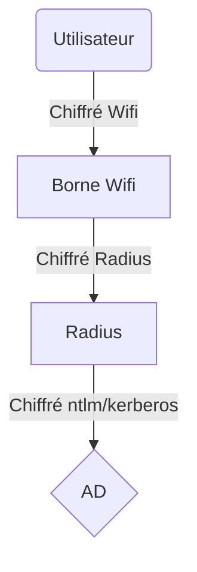

Kerberos (mieux que ntlm car utilise des tickets)

NTLM

Radius = centralisateur d'authentification. Il faut déclarer chaque client. Echanges chiffrés (clé différente pour chaque clients).
- Client radius : Borne Wifi, Switch, Proxy...

Squid = proxy linux

PEAP = envoie mot de passe en clair

MSCHAP = Protocole d'authentification. N'envoi pas mdp en clair. Méthode du défis. Nombre N envoyé par l'AD -> Client chiffre N avec hash de son mdp -> AD vérifie que N est correcte (car il possède le hash) -> Si correcte il valide en PEAP -> Si pas correcte il ne valide pas .

